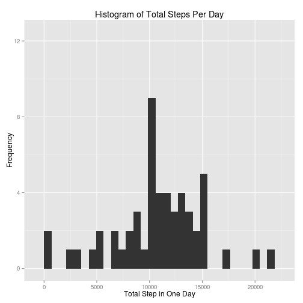

## Loading and preprocessing the data
Load necessary packages:

```r
library(dplyr)
library(ggplot2)
```

Unzip raw data file if necessary:

```r
if(!file.exists("activity.csv")) {
    if(!file.exists("activity.zip")) {
        print("Source data not in working directory.")
    } else unzip("activity.zip")
}
```

Load raw data and format date variable:

```r
activity <- tbl_df(read.csv("activity.csv"))
activity$date <- as.Date(activity$date, format="%Y-%m-%d")
```


## What is mean total number of steps taken per day?
Calculate total steps per day:

```r
activity_by_day <- group_by(activity, date)
stepsperday <- summarize(activity_by_day, totalsteps = sum(steps))
```


```r
qplot(totalsteps, data=stepsperday, xlab="Total Step in One Day",
      ylab="Frequency", main="Histogram of Total Steps Per Day")
```

 


```r
meansteps <- mean(stepsperday$totalsteps, na.rm=T)
mediansteps <- median(stepsperday$totalsteps, na.rm=T)
```

**Mean Steps Per Day:** ``10766.19``  
**Median Steps Per Day:** ``10765``  

## What is the average daily activity pattern?
Calculate the average steps per interval:

```r
activity_by_time <- group_by(activity, interval)
avginterval <- summarise(activity_by_time, average = mean(steps, na.rm=T))
qplot(x=interval, y=average, data=avginterval, geom="line",
      xlab="Time of Day (minutes from midnight)", ylab="Average Number of Steps Recorded")
```

 


```r
maxinterval <- avginterval[avginterval$average==max(avginterval$average),1]
```

The interval at **``835``** minutes contains the maximum number of average steps.

## Imputing missing values
Calculate the total number of missing values:

```r
numofna <- sum(is.na(activity))
```

There are **``2304``** NA values in the data set.

The mean steps at the matching inverval shall be used to estimate NA values.


```r
activityimpute <- activity
replacementvalues <- activityimpute %>% filter(is.na(steps)) %>% left_join(avginterval)
```

```
## Joining by: "interval"
```

```r
activityimpute$steps[is.na(activityimpute$steps)] <- replacementvalues$average
```

Calculate total steps per day with imputed data:

```r
activity_by_day_impute <- group_by(activityimpute, date)
stepsperdayimpute <- summarize(activity_by_day_impute, totalsteps = sum(steps))
```


```r
qplot(totalsteps, data=stepsperdayimpute, xlab="Total Step in One Day",
      ylab="Frequency", main="Histogram of Total Steps Per Day (Imputed Data)")
```

 

```r
qplot(totalsteps, data=stepsperday, xlab="Total Step in One Day",
      ylab="Frequency", main="Histogram of Total Steps Per Day", ylim=c(0,12.5))
```

 


```r
meanstepsimpute <- mean(stepsperdayimpute$totalsteps, na.rm=T)
medianstepsimpute <- median(stepsperdayimpute$totalsteps, na.rm=T)
```


|Data Set| Mean| Median|
|--------|----:|------:|
|Original| ``10766.19``| ``10765``|
|Imputed| ``10766.19``| ``10766.19``|

The histograms show us that imputing the missing values greatly increases the steps in one day at the median value. 
However, there is little difference in the mean or median between the 2 data sets.

## Are there differences in activity patterns between weekdays and weekends?
Add factor variable for weekday vs weekend

```r
activityimpute$daytype[weekdays(activityimpute$date) %in% c("Saturday","Sunday")] <- "weekend"
activityimpute$daytype[!(weekdays(activityimpute$date) %in% c("Saturday","Sunday"))] <- "weekday"
activityimpute$daytype <- as.factor(activityimpute$daytype)
```

Build data set to plot average steps at each interval by weekday & weekend

```r
activitygrouped <- group_by(activityimpute, interval, daytype)
avgintervaldays <- summarise(activitygrouped, average = mean(steps, na.rm=T))
qplot(x=interval, y=average, data=avgintervaldays, facets=daytype~., geom="line",
      xlab="Time of Day (minutes from midnight)", ylab="Average Number of Steps Recorded")
```

 

The above graph show significant differences in activity patterns on weekdays and weekends. 
